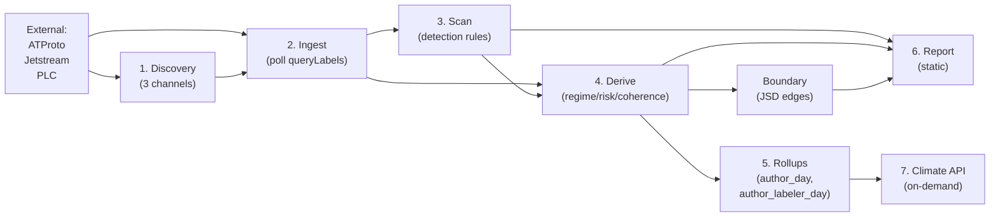

# labelwatch — Dataflow

## Stage gates

Each stage has its own gates that can suppress signals from advancing:

| Stage | Gates |
|-------|-------|
| 1. Discovery | DB write failure → crash (no silent loss) |
| 2. Ingest | Cursor persistence + event_hash dedup as safety net |
| 3. Scan | Warmup gate; sparse gate (rate rules suppressed below volume threshold) |
| 4. Derive | Hysteresis (N consecutive passes for state change) |
| 5. Rollups | None (deterministic aggregation) |
| 6. Report | Cooldown filter; fight gate (≥2 shared targets) |
| 7. Climate API | Per-IP rate limit; concurrency semaphore; generation timeout; payload whitelist; kill switch |

See `../DATAFLOW.md` for stage detail and `../FAILURE_MODES.md` for what each gate prevents.
