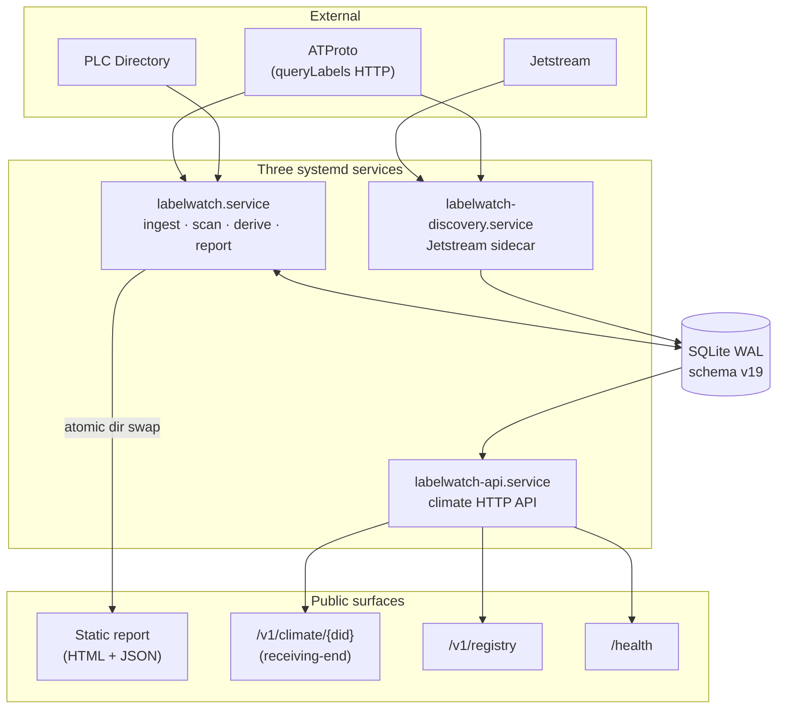

# labelwatch — System overview

## Notes

- Three services share one SQLite database (WAL mode). Subsystem isolation: each subsystem in the main service is wrapped in try/except so one crash doesn't kill the others.
- Climate API binds loopback only; Caddy reverse proxy handles TLS and external access.
- See `../OVERVIEW.md` for invariants and component inventory.
